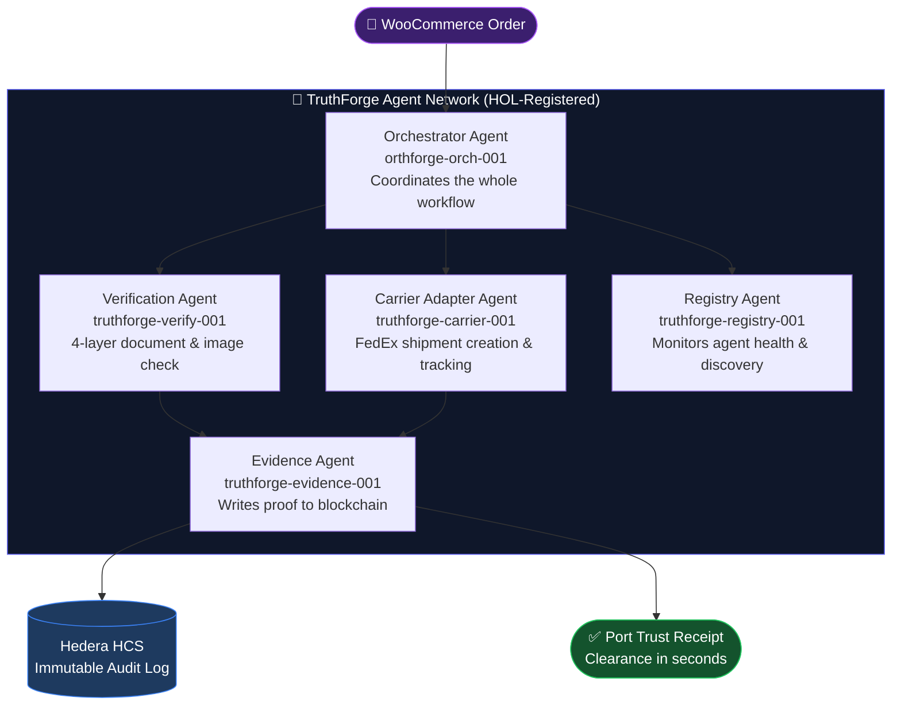

<p align="center">
  
</p>

<h1 align="center">TruthForge</h1>
<p align="center"><strong>The Verifiable Intelligence Layer for Global Trade</strong></p>
<p align="center"><em>Hedera Hello Future Apex Hackathon 2026 — AI & Agentic Track + HOL Bounty</em></p>

<p align="center">
  <a href="https://truthforge-frontend.vercel.app"></a>
  <a href="https://web-production-dcd43.up.railway.app/health"></a>
  <a href="https://hashscan.io/testnet/topic/0.0.8161249"></a>
  
  
  
  
</p>

---

## What is TruthForge?

When a ship carrying cargo approaches a port, customs officers have to manually check stacks of documents — Bills of Lading, certificates of origin, commercial invoices — before the vessel can dock. This takes days, costs money, and is wide open to fraud.

**TruthForge fixes this.** It's a network of 5 AI agents that automatically verify shipment documents *before the ship arrives*, then write a tamper-proof "Port Trust Receipt" to the Hedera blockchain. When the vessel docks, clearance takes seconds instead of days.

---

## Live Links

| | URL |
|---|---|
| 📢 Pitch Deck | 
| 🌐 Frontend Dashboard | https://truthforge-seven.vercel.app |
| ⚙️ Backend API | https://web-production-dcd43.up.railway.app |
| 🔗 Agent Registry on Hedera | https://hashscan.io/testnet/topic/0.0.8161249 |
| 🧾 Sample Audit Transaction | https://hashscan.io/testnet/transaction/0.0.7974354 |
| 🛒 Live Merchant Store | https://www.a-thi.online |
| 📁 Project Documentation| https://truthforge.mintlify.app |
| 📋 Product Requirements Doc | [docs/PRD.md](docs/PRD.md) |

---

## How It Works

A merchant places an order. Five AI agents spring into action — each with a specific job — and the whole process completes in minutes, not days.



### Step by step

1. A customer places an order on the merchant's WooCommerce store
2. The webhook fires → **Orchestrator** picks it up
3. **Carrier Agent** creates a FedEx shipment and returns a tracking number
4. **Verification Agent** runs a 4-layer check on shipping documents and cargo photos:
   - EXIF metadata analysis (was this photo edited?)
   - Lighting consistency (does the lighting look real?)
   - AI artifact detection (was this image AI-generated?)
   - File metadata verification (does the file match what it claims to be?)
5. **Registry Agent** confirms all agents are healthy throughout
6. **Evidence Agent** writes the final result to Hedera HCS and issues a **Port Trust Receipt**
7. Port authority scans the receipt — shipment is cleared ✅

---

## The 5 Agents

| Agent | ID | HCS Topic | What it does |
|---|---|---|---|
| Orchestrator | `truthforge-orch-001` | `0.0.8161244` | Runs the whole workflow, parses natural language requests |
| Verification & Compliance | `truthforge-verify-001` | `0.0.8161247` | Checks documents and cargo photos for fraud |
| Carrier Adapter | `truthforge-carrier-001` | `0.0.8161248` | Talks to FedEx, UPS, DHL, Maersk, MSC |
| Registry & Discovery | `truthforge-registry-001` | `0.0.8161249` | Tracks which agents are online and healthy |
| Evidence & Settlement | `truthforge-evidence-001` | `0.0.8161250` | Writes proof to Hedera, issues Port Trust Receipts |

---

## Tech Stack

| Layer | Technology |
|---|---|
| Blockchain | Hedera Testnet — HCS-10 protocol, pure REST (no Java SDK) |
| Backend | Python 3.11, Flask, SQLAlchemy |
| Frontend | React + Vite + Tailwind CSS |
| Database | PostgreSQL on Supabase (SQLite fallback for dev) |
| Carrier API | FedEx Sandbox (OAuth 2.0) |
| Commerce | WooCommerce REST API + HMAC-verified webhooks |
| Hosting | Railway (backend) + Vercel (frontend) |
| Real-time | FastAPI WebSocket server |

---

## Project Structure

```
truthforge/
├── agents/                  # The 5 AI agents
│   ├── orchestrator_agent.py
│   ├── verification_compliance_agent.py
│   ├── carrier_adapter_agent.py
│   ├── registry_discovery_agent.py
│   ├── evidence_settlement_agent.py
│   ├── fedex_client.py      # FedEx OAuth 2.0
│   ├── hedera_client.py     # Hedera REST client
│   └── hcs10_message.py     # HCS-10 message protocol
├── api/
│   ├── app.py               # All REST endpoints
│   └── auth.py              # API key roles & auth
├── database/
│   ├── models.py            # ORM models
│   └── services.py          # Business logic
├── hol_registry/
│   └── registry.py          # Agent registration & discovery
├── woocommerce/webhooks/
│   └── order_webhook.py     # HMAC-verified order intake
├── websocket/
│   └── routes.py            # Real-time tracking updates
├── truthforge_frontend/     # React dashboard (deployed to Vercel)
├── tests/                   # 30 test files
├── docs/                    # All documentation
└── main.py                  # App entry point (gunicorn)
```

---

## Running Locally

**Prerequisites:** Python 3.11+, Node.js 18+

```bash
# 1. Clone and install
git clone https://github.com/Ai-Tech-Haven/truthforge.git
cd truthforge
pip install -r requirements.txt

# 2. Configure environment
cp .env.example .env
# Set MOCK_MODE=true to run without real API keys

# 3. Initialize the database
python init_database.py

# 4. Start the backend
python main.py
# API available at http://localhost:5000

# 5. Start the frontend (separate terminal)
cd truthforge_frontend/truthforge-logistics-verified-main
npm install
npm run dev
# Dashboard at http://localhost:5173
```

### Mock mode vs Live mode

| | Mock Mode (`MOCK_MODE=true`) | Live Mode (`MOCK_MODE=false`) |
|---|---|---|
| Hedera | Simulated transaction IDs | Real Testnet HCS submissions |
| FedEx | Fake tracking numbers | FedEx Sandbox API |
| WooCommerce | Simulated orders | Live store at a-thi.online |
| Database | SQLite | PostgreSQL (Supabase) |
| Cost | Free | Small HBAR per transaction |

---

## API Endpoints

| Method | Endpoint | Description |
|---|---|---|
| `POST` | `/api/verify` | Submit a verification (text or structured) |
| `GET` | `/api/status/<id>` | Check verification progress |
| `GET` | `/api/agents` | See all 5 agents and their health |
| `GET` | `/api/dashboard/metrics` | Live operational stats |
| `GET` | `/api/clearance/queue` | Pre-arrival shipment queue |
| `GET` | `/api/port-trust-receipts` | Issued clearance receipts |
| `GET` | `/api/v1/proof/<shipment_id>` | Full cryptographic proof package |
| `GET` | `/api/hcs/messages` | Live messages from Hedera mirror node |
| `POST` | `/webhook/woocommerce/order` | WooCommerce order intake |
| `GET` | `/health` | System health check |

---

## Running Tests

```bash
pytest tests/ -v
```

30 tests covering agents, API endpoints, Hedera client, FedEx adapter, WooCommerce webhooks, and end-to-end order flows.

---

## Documentation

All docs live in [`/docs`](docs/):

- [PRD.md](docs/PRD.md) — Full product requirements
- [SETUP_GUIDE.md](docs/SETUP_GUIDE.md) — Detailed setup instructions
- [DATABASE_GUIDE.md](docs/DATABASE_GUIDE.md) — Database models and usage
- [WEBSOCKET_GUIDE.md](docs/WEBSOCKET_GUIDE.md) — Real-time WebSocket endpoints
- [API_KEYS_README.md](docs/API_KEYS_README.md) — API key roles and authentication
- [TRUTHFORGE_STATUS.md](docs/TRUTHFORGE_STATUS.md) — Full deployment status

---

## Hackathon Tracks

| Track | How TruthForge qualifies |
|---|---|
| AI & Agentic | 5 autonomous agents with HCS-10 messaging, natural language intent parsing, multi-agent coordination |
| HOL Bounty | Full HOL agent registration, capability-based discovery, consensus anchoring on every verification |
| Real-World Impact | Live WooCommerce store + FedEx sandbox + Port Trust Receipts for actual pre-arrival clearance |

---

## Roadmap

- **Phase 1 (Now):** Full agent orchestration with mock/live Hedera toggle ✅
- **Phase 2:** Prediction markets for logistics — hedge against port delays
- **Phase 3:** Mainnet deployment + pilot with Port Authorities in West Africa

---

**Built by [Ai-Tech-Haven](https://github.com/Ai-Tech-Haven)** | Hedera Hello Future Apex Hackathon 2026 | Status: Submission Ready 🟢
