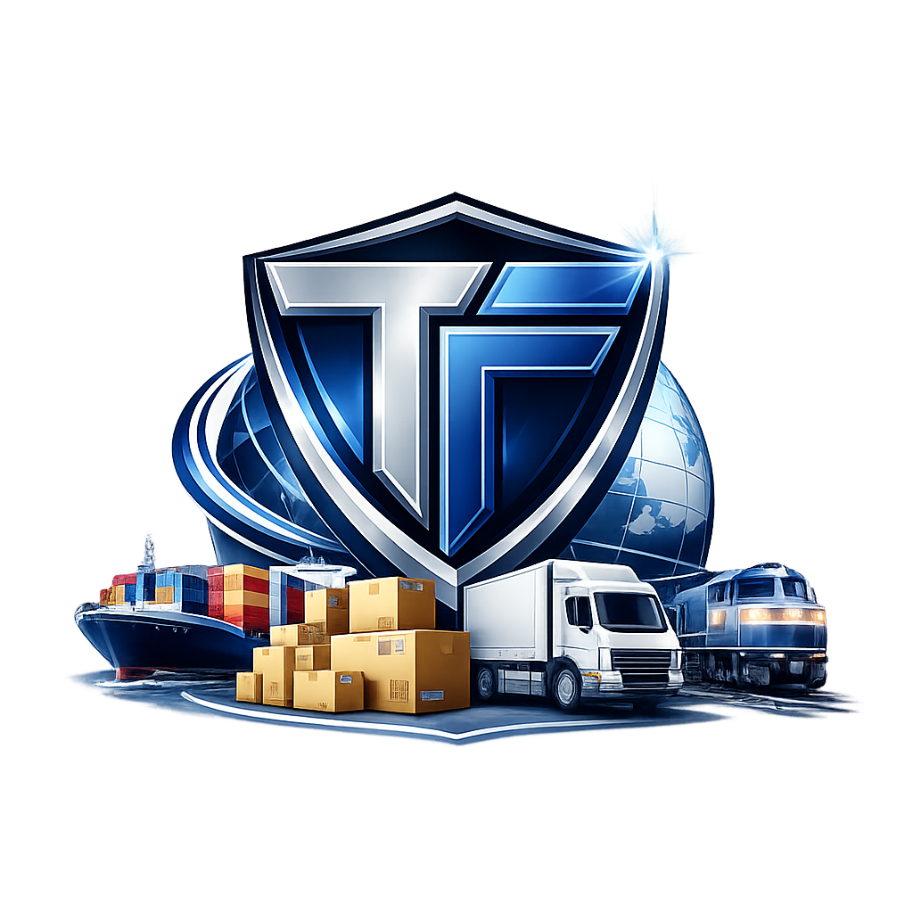

  

<h1 align="center">TruthForge</h1>

<strong>The Verifiable Intelligence Layer for Global Trade</strong>

  <em>Hedera Hello Future Apex Hackathon 2026 — AI & Agentic Track + HOL Bounty</em>

  
  
  
  
  
  
  

---

# TruthForge
> **The Verifiable Intelligence Layer for Global Trade**
> *Built for Hedera Hello Future Apex Hackathon 2026 — AI & Agentic Track + HOL Bounty*

TruthForge is a multi-agent verification platform built on the **Hedera Hashgraph Online (HOL) protocol**. It automates and secures pre-arrival clearance for global shipments—connecting merchants, carriers, and port authorities through a unified, tamper-proof intelligence layer.

---

## ⚡ The Solution: Bridging the Logistics Trust Gap

| Problem | TruthForge Solution |
| :--- | :--- |
| **Port Clearance Delays** | Autonomous pre-arrival verification in minutes. |
| **Document Fraud** | Immutable, HCS-anchored cryptographic proof. |
| **Siloed Data** | Unified multi-agent network registered on Hedera HOL. |
| **Manual Compliance** | 5 Autonomous Agents managing the entire workflow. |

---

## 🤖 The HOL-Registered Agent Network
TruthForge utilizes **5 specialized AI Agents**, each registered with unique capabilities on the Hedera HOL protocol to ensure a decentralized and resilient supply chain.

1. **Orchestrator Agent (`orch-001`)**: The central brain coordinating order-to-clearance workflows.
2. **Verification Agent (`verify-001`)**: Handles document intelligence and 4-layer deepfake detection for shipping manifests.
3. **Carrier Adapter Agent (`carrier-001`)**: Integrates directly with the **FedEx Sandbox API** to normalize shipment data.
4. **Registry Agent (`registry-001`)**: Manages real-time discovery and health monitoring across the HOL network.
5. **Evidence Agent (`evidence-001`)**: Generates "Port Trust Receipts" and logs final audit trails to **Hedera HCS**.

---

## 🛠️ Tech Stack & Hedera Integration
* **[span_1](start_span)Network**: Hedera Testnet (HCS, HTS, HOL Protocol)[span_1](end_span)
* **AI Framework**: Custom Multi-Agent Python Framework
* **Backend**: Flask REST API (Python 3.9+)
* **Frontend**: React + Vite (Tailwind CSS)
* **Partner APIs**: FedEx Sandbox (OAuth 2.0), WooCommerce REST API
* **Infrastructure**: Railway (Backend), Vercel (Frontend), Supabase (PostgreSQL)

---

## 🚀 Live Demo & Evidence
* **Frontend**: [Live Dashboard on Vercel](https://truthforge-frontend.vercel.app)
* **Agent Registry**: Verified on Hedera Testnet (Topic: `0.0.8161249`)
* **Transaction Proof**: [View Audit Record on HashScan](https://hashscan.io/testnet/transaction/0.0.7974354)

---

## 🛤️ Roadmap: Moving Beyond the Hackathon
* **Phase 1 (MVP)**: Full AI-Agent orchestration with Mock/Live Hedera toggle.
* **Phase 2**: Prediction Markets for logistics—allowing users to hedge against port delays.
* **Phase 3**: Mainnet deployment and pilot integration with Port Authorities in West Africa.

---
**Founder**: Ai-Tech-Haven 
**Status**: Submission Ready 🟢
